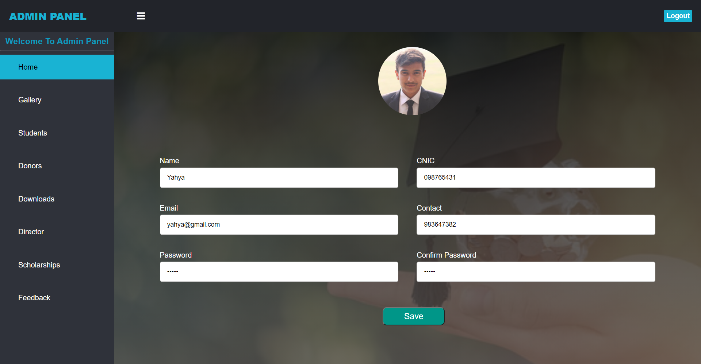

## Title
Student Financial Aid

## Overview
This project is developed using HTML, CSS, JavaScript, PHP, and MySQL. It is designed to deal with all the matters of scholarships and financial aid of students.

## Main Features
- Admin Panel to update gallery, manage donors, students, and scholarships
- Student Panel for students to get update about scholarships, and register themselves in scholarships
- Donor Panel for donors to register in system, about scholarships, donate scholarships, and give their feedback

## Technologies Used
- HTML
- CSS
- JavaScript
- PHP
- MySQL

## Admin Panel

## User Panel
